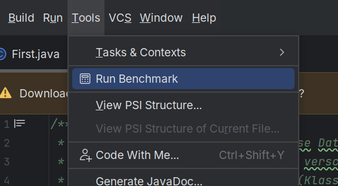

# hashbench-intellij
IntelliJ plugin for benchmarking SHA-256 implementations.

> [!NOTE]
> This repository contains supplementary material of the following paper:  
>
> Björn Fischer, Marc Stöttinger, Berit Barthelmes, Sven Eric Panitz, and Ralf
Dörner. 2025. Credential-Based Pseudonym Generation for Programming
Process Data Collection. In Proceedings of the 30th ACM Conference on
Innovation and Technology in Computer Science Education V. 1 (ITiCSE 2025),
June 27-July 2, 2025, Nijmegen, Netherlands. ACM, New York, NY, USA,
7 pages. https://doi.org/10.1145/3724363.3729046

## Setup

1. Install Docker
2. Run `docker compose up`. 

## Plugin Usage
To install the plugin, navigate to `File` -> `Settings` -> `Plugins` -> `⚙` -> `Manage Plugin Repositories`. Add the url of the plugin repository ([`https://localhost:8443/`](https://localhost:8443)), click `OK`, and search for the plugin (`hashbench`). After installing, the `Tools` menu should have an item `Run Benchmark`:



After benchmarking has finished (~5 minutes), the results are shown along with instructions on how to send these by email to a configured email address. You can change the mail address in [ResultDialog.java](src/main/java/hashbench/benchmark/ResultDialog.java). If you do, remember to rebuild the docker image.

## Benchmarking Methodology
Benchmarking is performed by iterative hashing on a constant input. The plugin measures the single-thread performance in hashes per second (H/s) of the following SHA-256 implementations:

- The implementation provided by the JRE used to run IntelliJ.
- The third-party implementation of the [BouncyCastle](https://www.bouncycastle.org/) library.

While there are other libraries  that offer SHA-256 implementations (such as [Google Guava](https://github.com/google/guava) and [Apache Commons Codec](https://commons.apache.org/proper/commons-codec/)), we decided to exclude them as these are wrappers around the implementation provided by the JRE.

Benchmarking is subject to various non-deterministic factors that may bias the results. Thus, we:

- run some iterations for each implementation as warm-up before measuring performance. (To address bias caused by system load, priming of caches, and JIT compilation)
- keep references to the computed hashes although we are not interested in them. (To address bias caused by performance optimizations, such as statement reordering)
- perform multiple runs in random order, where each run is performed in a new thread, with only one thread being running at any given time. After all runs are performed, we calculate the final hash rate by averaging the hash rates measured in each run. (To address bias caused by mapping Java threads to native threads on the operating system)
- prompt to shutdown other programs before benchmarking. Moreover, we pause for 30 seconds between runs. (To address bias caused by system load)
- use the `System.nanoTime()` method for measuring time. (To address bias caused by NTP clock adjustments)

Before benchmarking, the plugin extracts various properties of the runtime environment. These include details about the operating system, hardware, and the JRE. To extract these properties, we use the [OSHI](https://github.com/oshi/oshi) library and the `System.getProperty()` method.

## Results Format

<details>

```json
{
  "runsPerImpl" : 5,
  "warmupRunsPerImpl" : 1,
  "iterations" : 2500000,
  "pauseBetweenRuns" : 30000,
  "input" : "mmustermd8L_sA$9",
  "results" : [ {
    "implementation" : "BouncyCastleSHA256",
    "hash" : "3cd28e33a05b816fd9625048ed7d0466e640fae75b2c54058deff0ec2a7b962a",
    "elapsedMillisecondsMean" : 797.9108952,
    "elapsedMillisecondsStd" : 57.502498423739915,
    "hashesPerSecondMean" : 3148763.284934708,
    "hashesPerSecondStd" : 216420.24883055998
  }, {
    "implementation" : "JRESHA256",
    "hash" : "3cd28e33a05b816fd9625048ed7d0466e640fae75b2c54058deff0ec2a7b962a",
    "elapsedMillisecondsMean" : 181.2744968,
    "elapsedMillisecondsStd" : 15.159845621271868,
    "hashesPerSecondMean" : 1.3883912406802397E7,
    "hashesPerSecondStd" : 1108925.4312925213
  } ],
  "sysInfo" : {
    "osFamily" : "Linux Mint",
    "osManufacturer" : "GNU/Linux",
    "cpu" : {
      "maxFreq" : 4507000000,
      "currentFreq" : [ 2695048000, 2695245000, 2145910000, 400000000, 2695012000, 400000000, 2152278000, 400000000, 2634659000, 2695025000, 2406864000, 400000000, 400000000, 2694996000, 400000000, 2487389000 ],
      "contextSwitches" : 77001426,
      "interrupts" : 52810181,
      "systemCpuLoadTicks" : [ 8186060, 2540, 994260, 175853160, 70250, 0, 30350, 0 ],
      "processorCpuLoadTicks" : [ [ 488220, 0, 62170, 10991530, 4430, 0, 17650, 0 ], [ 468790, 0, 30820, 11085300, 1370, 0, 230, 0 ], [ 398780, 0, 54310, 11118730, 3420, 0, 490, 0 ], [ 331340, 0, 26920, 11232190, 1460, 0, 90, 0 ], [ 896470, 150, 153260, 10475870, 11970, 0, 180, 0 ], [ 707150, 0, 74310, 10744590, 6310, 0, 810, 0 ], [ 387010, 0, 62410, 11121950, 4450, 0, 110, 0 ], [ 312840, 0, 29890, 11247160, 1290, 0, 100, 0 ], [ 522610, 70, 81100, 10937140, 5810, 0, 6560, 0 ], [ 494480, 0, 35010, 11059940, 1780, 0, 100, 0 ], [ 405610, 0, 58480, 11075130, 3650, 0, 3510, 0 ], [ 360510, 0, 28600, 11201110, 1290, 0, 80, 0 ], [ 860150, 2220, 143010, 10530240, 12160, 0, 150, 0 ], [ 695030, 10, 55190, 10832470, 4760, 0, 80, 0 ], [ 468480, 40, 68620, 11027500, 4640, 0, 110, 0 ], [ 388510, 0, 30090, 11172240, 1400, 0, 40, 0 ] ],
      "physicalPackageCount" : 1,
      "physicalProcessorCount" : 8,
      "logicalProcessorCount" : 16
    },
    "memory" : {
      "total" : 29237997568,
      "virtualMemory" : {
        "virtualInUse" : 11252568064,
        "swapPagesIn" : 0,
        "swapPagesOut" : 4,
        "swapTotal" : 2147479552,
        "swapUsed" : 524288,
        "virtualMax" : 16766476288
      },
      "pageSize" : 4096,
      "available" : 17985953792,
      "physicalMemory" : [ ]
    },
    "java" : {
      "java.vendor" : "JetBrains s.r.o.",
      "java.vm.specification.vendor" : "Oracle Corporation",
      "java.version" : "17.0.7",
      "java.vm.version" : "17.0.7+7-b1000.6",
      "java.vm.name" : "OpenJDK 64-Bit Server VM",
      "java.vm.specification.version" : "17",
      "java.vm.specification.name" : "Java Virtual Machine Specification",
      "java.vm.vendor" : "JetBrains s.r.o."
    }
  }
}
```
</details>

## Related tools
As we have noted in our paper, benchmarks often do not capture the overhead caused by the runtime environment. If you want to see how the overhead affects performance, you can use [hashcat](https://hashcat.net/hashcat/). The options that come closest to the benchmarking performed by this plugin are:

```
hashcat -m 1400 -D 1 -b --cpu-affinity=1 -w 1 # SHA2-256, kernel optimization disabled, single CPU
``` 

Running hashcat with these options on an AMD Ryzen 7 PRO 5850U gave the following results:

<details>

```
hashcat (v6.2.6) starting in benchmark mode

OpenCL API (OpenCL 3.0 PoCL 5.0+debian  Linux, None+Asserts, RELOC, SPIR, LLVM 16.0.6, SLEEF, DISTRO, POCL_DEBUG) - Platform #1 [The pocl project]
==================================================================================================================================================
* Device #1: cpu-haswell-AMD Ryzen 7 PRO 5850U with Radeon Graphics, 12885/25835 MB (4096 MB allocatable), 16MCU

Benchmark relevant options:
===========================
* --opencl-device-types=1
* --workload-profile=1

---------------------------
* Hash-Mode 1400 (SHA2-256)
---------------------------

Speed.#1.........: 24930.3 kH/s (1.09ms) @ Accel:32 Loops:64 Thr:1 Vec:8

Started: Wed Nov  6 22:21:43 2024
Stopped: Wed Nov  6 22:21:49 2024
```
</details>

While running the plugin gave these results:

<details>

```json
{
  "runsPerImpl": 5,
  "warmupRunsPerImpl": 1,
  "iterations": 2500000,
  "pauseBetweenRuns": 30000,
  "input": "mmustermd8L_sA$9",
  "results": [
    {
      "implementation": "BouncyCastleSHA256",
      "hash": "3cd28e33a05b816fd9625048ed7d0466e640fae75b2c54058deff0ec2a7b962a",
      "elapsedMillisecondsMean": 749.1354890199999,
      "elapsedMillisecondsStd": 13.368216600274456,
      "hashesPerSecondMean": 3338213.7143915812,
      "hashesPerSecondStd": 57950.2041334752
    },
    {
      "implementation": "JRESHA256",
      "hash": "3cd28e33a05b816fd9625048ed7d0466e640fae75b2c54058deff0ec2a7b962a",
      "elapsedMillisecondsMean": 162.13316344,
      "elapsedMillisecondsStd": 3.203018146042761,
      "hashesPerSecondMean": 1.542536318794936E7,
      "hashesPerSecondStd": 300719.91718990944
    }
  ],
  "sysInfo": {}
}
```
</details>

When comparing the plugin (15.4 MH/s, JRESHA256) with hashcat (24.93 MH/s), we see that hashcat can be roughly 60% faster. We also ran hashcat with optimized kernel code and observed that it was roughly 150% faster (38,7 MH/s).